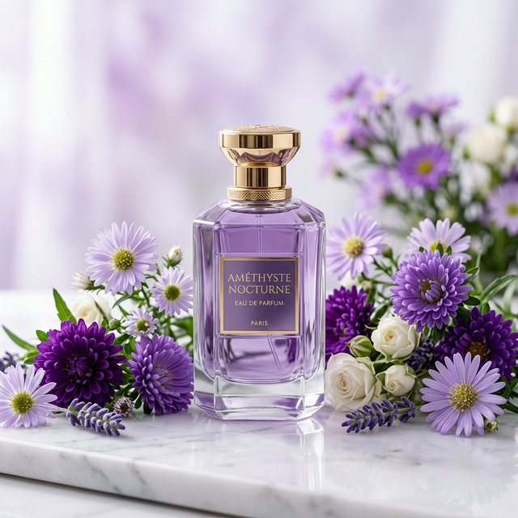

<div align="center">
  
</div>

<br/>

<div align="center">

# AMBRELLE FRAGRANCE BLOG

**A luxury fragrance editorial platform — where scent becomes identity.**

[](https://nextjs.org/)
[](https://supabase.com/)
[](https://typescriptlang.org/)
[](https://tailwindcss.com/)
[](https://www.framer.com/motion/)
[](https://vercel.com/)

</div>

---

## ✨ Overview

**Ambrelle Fragrance Blog** is a premium, fully-interactive editorial platform built for a luxury fragrance brand. It combines an immersive visual design with a complete content management system — allowing the brand owner to publish fragrance reviews, manage products, and convert readers into WhatsApp customers directly from blog posts.

<div align="center">
  
</div>

---

## 🚀 Features

### 🌐 Frontend
- **Kinetic hero section** with parallax scrolling, animated typography, and purple halo glow effects
- **Day/Night mode** toggle powered by `next-themes` (defaults to dark, respects system preference)
- **Fragrance card grid** — image-dominant cards with hover zoom, animated topic badges, and glassmorphism effects
- **Fragrance detail modal** — spring-animated popup with bottle image, aromatic pyramid breakdown (Top / Heart / Base notes), and a **WhatsApp order CTA**
- **Full responsiveness** — mobile, tablet, and desktop
- Smooth **Framer Motion** animations throughout (staggered entry, spring physics, kinetic marquee)

### 🔐 Authentication
- **Sign Up / Sign In** via Supabase Auth (email + password)
- Protected admin routes using middleware session validation
- Persistent session via `@supabase/ssr` cookie management

### 📝 Blog & Content Management
- **Admin Dashboard** — lists all posts with thumbnails and direct Edit buttons
- **Create Post** — drag-and-drop or click-to-upload fragrance photo to Supabase Storage; or paste a URL
- **Edit Post** — edit title, category, image, and full description in a beautiful form
- **Delete Post** — with confirmation modal to prevent accidents
- **Comment System** — authenticated visitors can leave comments on any post; unauthenticated users see a sign-in prompt

### 📲 WhatsApp Integration
- Every fragrance modal's **"Order via WhatsApp"** button pre-fills a message with the fragrance name to `+974 7406 8029`
- Contact button in the nav header also links to WhatsApp

---

## 🛠️ Tech Stack

| Layer | Technology |
|---|---|
| **Framework** | Next.js 16 (App Router, Server Actions) |
| **Database** | Supabase (PostgreSQL) |
| **Auth** | Supabase Auth + `@supabase/ssr` |
| **Storage** | Supabase Storage (post-images bucket) |
| **Styling** | Tailwind CSS v4 + Custom CSS Variables |
| **Animations** | Framer Motion 11 |
| **Theming** | next-themes |
| **Fonts** | Space Mono + Syncopate (Google Fonts) |
| **Deployment** | Vercel |

---

## 📦 Database Schema

```sql
-- Posts table
CREATE TABLE posts (
  id          UUID PRIMARY KEY DEFAULT gen_random_uuid(),
  title       TEXT NOT NULL,
  slug        TEXT UNIQUE,
  topic       TEXT,
  content     TEXT,
  image_url   TEXT,
  author_id   UUID REFERENCES auth.users(id),
  created_at  TIMESTAMPTZ DEFAULT now()
);

-- Comments table
CREATE TABLE comments (
  id          UUID PRIMARY KEY DEFAULT gen_random_uuid(),
  post_id     UUID REFERENCES posts(id),
  user_id     UUID REFERENCES auth.users(id),
  content     TEXT NOT NULL,
  created_at  TIMESTAMPTZ DEFAULT now()
);
```

---

## 🏁 Quick Start (Local Development)

### Prerequisites
- Node.js 18+
- A Supabase account and project

### 1. Clone the repository
```bash
git clone https://github.com/YOUR_USERNAME/ambrelle-fragrance.git
cd ambrelle-fragrance
```

### 2. Install dependencies
```bash
npm install
```

### 3. Configure environment variables
Create a `.env` file in the root with:
```env
NEXT_PUBLIC_SUPABASE_URL=https://your-project-ref.supabase.co
NEXT_PUBLIC_SUPABASE_ANON_KEY=your-anon-key-here
```
Get these from your Supabase project → **Settings → API**.

### 4. Set up the database
Run these migrations in your Supabase SQL Editor:
```sql
-- Enable RLS
ALTER TABLE posts ENABLE ROW LEVEL SECURITY;
ALTER TABLE comments ENABLE ROW LEVEL SECURITY;

-- Public can read posts
CREATE POLICY "Public read posts" ON posts FOR SELECT USING (true);

-- Authenticated users can insert posts
CREATE POLICY "Auth insert posts" ON posts FOR INSERT TO authenticated WITH CHECK (true);

-- Auth users can update/delete their own posts
CREATE POLICY "Auth update posts" ON posts FOR UPDATE TO authenticated USING (true);
CREATE POLICY "Auth delete posts" ON posts FOR DELETE TO authenticated USING (true);

-- Comments policies
CREATE POLICY "Public read comments" ON comments FOR SELECT USING (true);
CREATE POLICY "Auth insert comments" ON comments FOR INSERT TO authenticated WITH CHECK (auth.uid() = user_id);
```

### 5. Create Storage Bucket
In Supabase → Storage → create a new bucket called `post-images` and set it to **Public**.

### 6. Run the development server
```bash
npm run dev
```
Open [http://localhost:3000](http://localhost:3000) 🎉

---

## 🚢 Deploying to Vercel

### Step 1 — Push to GitHub
```bash
git add .
git commit -m "feat: initial production release"
git push origin main
```

### Step 2 — Import on Vercel
1. Go to [vercel.com/new](https://vercel.com/new)
2. Click **"Add New Project"**
3. Import your GitHub repository
4. Vercel will auto-detect it as a **Next.js** project

### Step 3 — Add Environment Variables
In the Vercel project settings → **Environment Variables**, add:
```
NEXT_PUBLIC_SUPABASE_URL     = https://your-project-ref.supabase.co
NEXT_PUBLIC_SUPABASE_ANON_KEY = your-anon-key
```

### Step 4 — Deploy
Click **Deploy**. Vercel will build and publish your app in ~2 minutes. 🚀

> ⚠️ **Important**: After deploying, go to your Supabase project → **Authentication → URL Configuration** and add your Vercel URL (e.g., `https://ambrelle.vercel.app`) as both a **Site URL** and **Redirect URL**.

---

## 📁 Project Structure

```
ambrelle-fragrance/
├── public/                     # Static assets (logo, hero images)
├── src/
│   ├── app/
│   │   ├── admin/              # Admin dashboard + create/edit post pages
│   │   │   ├── page.tsx        # Admin dashboard listing all posts
│   │   │   ├── actions.ts      # Server actions: createPost, updatePost, deletePost
│   │   │   ├── create-post/    # Create new post with image upload
│   │   │   └── edit-post/[id]/ # Edit existing post
│   │   ├── blog/
│   │   │   ├── [slug]/         # Dynamic blog post detail page
│   │   │   ├── actions.ts      # addComment server action
│   │   │   └── CommentSection.tsx
│   │   ├── login/              # Login + signup page
│   │   │   ├── page.tsx
│   │   │   └── actions.ts      # login, signup, signout server actions
│   │   ├── page.tsx            # Homepage (fetches session + posts)
│   │   ├── layout.tsx          # Root layout with ThemeProvider
│   │   └── globals.css
│   ├── components/
│   │   ├── AmbrelleClientPage.tsx  # Main page client component
│   │   ├── FragranceModal.tsx      # Animated popup modal
│   │   ├── ThemeProvider.tsx       # next-themes provider
│   │   └── ThemeToggle.tsx         # Day/Night mode toggle
│   ├── lib/
│   │   ├── supabase-server.ts  # Server-side Supabase client
│   │   ├── supabase.ts         # Browser-side Supabase client
│   │   └── supabase-client.ts  # Re-export for admin pages
│   └── middleware.ts           # Auth session refresh middleware
├── next.config.ts              # Image domains + security headers
├── .gitignore
└── package.json
```

---

## 🎨 Design System

| Token | Light Mode | Dark Mode |
|---|---|---|
| Background | `#FAFAFA` | `#13091B` |
| Text | `#2C143B` | `#F1E3FC` |
| Accent | `#692484` | `#692484` |
| Card BG | `#FFFFFF` | `#1A0A24` |
| Muted Text | `#2C143B/60` | `#F1E3FC/60` |

**Fonts:** Space Mono (body) + Syncopate (headings)

---

## 📄 License

MIT © 2026 Ambrelle Fragrance. All rights reserved.
